<html>
<head>
  <link rel="preconnect" href="https://googleapis.com">
  <link rel="preconnect" href="https://gstatic.com" crossorigin>
  <link href="https://googleapis.com/css2?family=Cairo:wght@500&display=swap" rel="stylesheet">

  <link rel="preconnect" href="https://googleapis.com">
  <link rel="preconnect" href="https://gstatic.com" crossorigin>
  <link href="https://googleapis.com/css2?family=Ubuntu:ital,wght@1,700&display=swap" rel="stylesheet">
</head>

 
  
  <h1 align="center" style="font-family: Ubuntu; font-weight: 700; font-style: italic; font-size: 64px; color: #2F2D2E; margin-top: 25px;">TipTap</h1>
  <h2 align="center" style="font-size: 32px; color: #2F2D2E; margin-top: 15px">Developed by <a href="https://github.com/Chloe-Larsen" style="color: #9EAF9A;">Chloe Larsen - u25004141</a></h2>
  

  <h2 style="font-size: 32px; color: #2F2D2E; margin-top: 25px">Styles:</h2>
  
  <h3 style="font-size: 28px; color: #2F2D2E; margin-top: 15px; padding-bottom: 0px;">Colours</h3>
  <ul style="margin-top: 0px">
    <li style="color: #000000;">Background colour: #E1E3DA</li>
    <li style="color: #2F2D2E;">Main text: #2F2D2E</li>
    <li style="color: #66815D;">Titles and Button Backs: #66815D</li>
    <li style="color: #9EAF9A;">Links: #9EAF9A</li>
    <li style="color: #AEB3A2;">Tags: #AEB3A2</li>
  </ul>  
  
  

  <h3 style="font-size: 28px; color: #2F2D2E; margin-top: 15px; padding-bottom: 0px;">Font</h3>
  <ul style="margin-top: 0px">
    <li style="font-family: Ubuntu; font-weight: 700; font-style: italic">Brand name: Ubuntu Bold Italic 64</li>
    <li style="font-weight: 500;">Titles: Cairo Medium 64</li>
    <li>Other Text: Cairo Regular 32</li>
  </ul>
  

  <h2 style="font-size: 32px; color: #2F2D2E; margin-top: 15px; padding-bottom: 0px;">Page Explanations:</h2>

  <h3 style="font-size: 28px; color: #2F2D2E; margin-top: 15px; padding-bottom: 0px;">Splash Page</h3>
  

    The splash page is the welcome page of TipTap. This the page all users will encounter first. They can click the `Log In` button to log into their account if they already have an account. Else they can click the `Sign Up` button to sign up to join TipTap.
  

  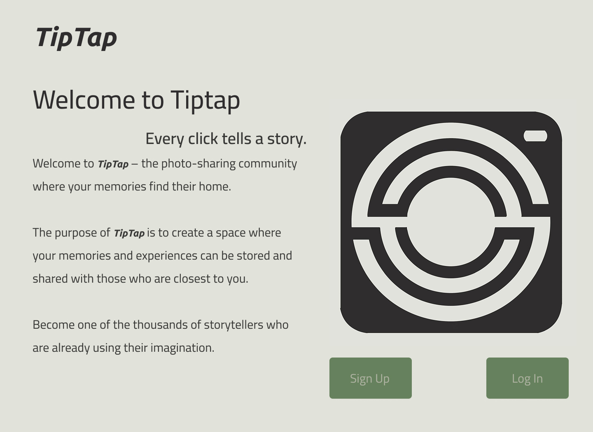

  

  <h3 style="font-size: 28px; color: #2F2D2E; margin-top: 5px; padding-bottom: 0px;">Sign Up Page</h3>
  

    This is the page where the users who are signing up for TipTap must enter their information in order to join the platform. They must enter their:
    <ul>
      <li>Name</li>
      <li>Surname</li>
      <li>Email Address</li>
      <li>Password (enforcing password rules of minimum of 8 characters and at least 1 digit)</li>
      <li>Password Again</li>
      <li>Pronouns</li>
      <li>Username (Which must be unique)</li>
      <li>A Short Bio</li>
      <li>Links to Other Websites or Social Media Platforms - optional</li>
    </ul>   
  

  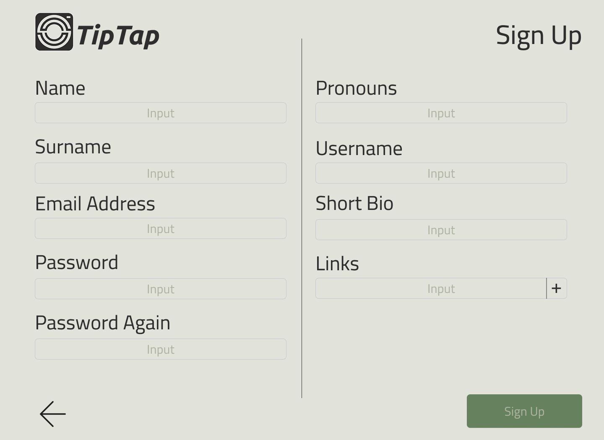

  

  <h3 style="font-size: 28px; color: #2F2D2E; margin-top: 5px; padding-bottom: 0px;">Log In Page</h3>
  

    This is the login page. The user must enter their email address or username and their password. If the user has forgotten their password then they can click the forgot password page which will send the user an email with a link to set their new password.
  

  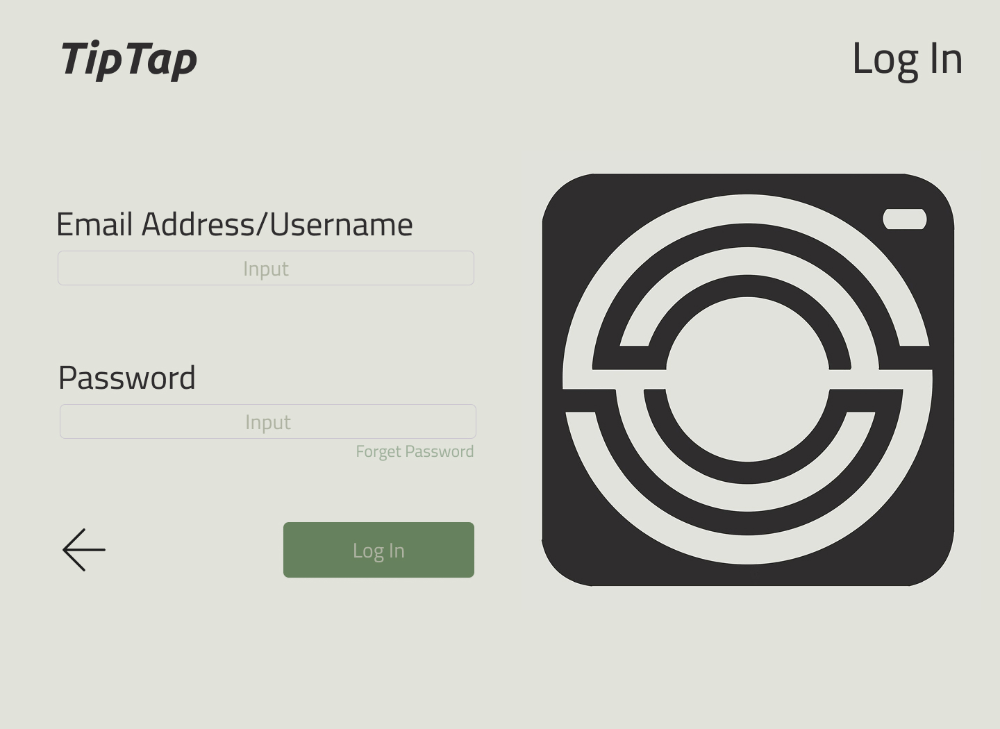

  

  <h3 style="font-size: 28px; color: #2F2D2E; margin-top: 5px; padding-bottom: 0px;">Edit Profile Page</h3>
  

    This is the page where the user can edit their information, or add a profile picture. When they have changed something they must then click the `save` button to save the changed information to the database.
  

  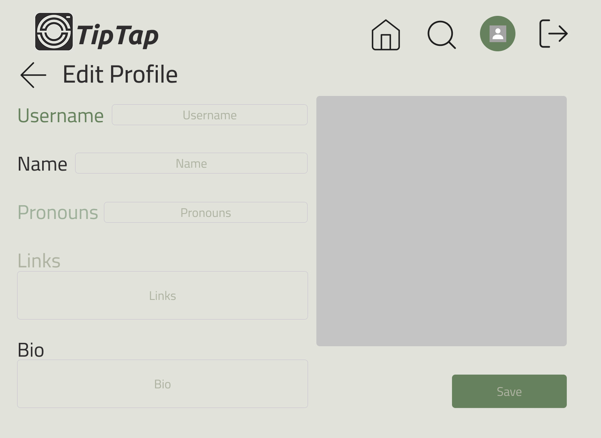

  

  
  <h3 style="font-size: 28px; color: #2F2D2E; margin-top: 5px; padding-bottom: 0px;">Home Page - Local Feed</h3>
  

   This is the page where a user can view their friends activity in reverse chronological order (newest to oldest). A user can:
   <ul>
      <li>Leave Comments on Others User's Posts</li>
      <li>Like Other User's Posts</li>
      <li>Report Other User's Posts</li>
      <li>Apply Filters to Order The Posts in a Different Way The Reverse Chronological Order</li>
    </ul>
  

  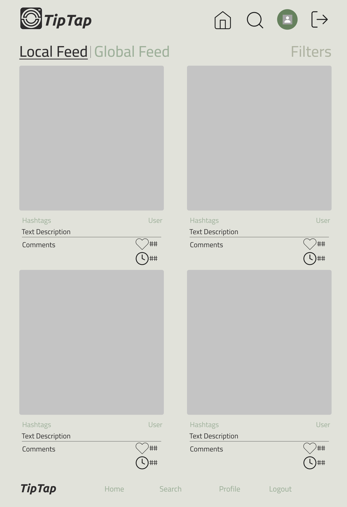
  
  

  <h3 style="font-size: 28px; color: #2F2D2E; margin-top: 5px; padding-bottom: 0px;">Home Page - Global Feed</h3>
  

    This is the page where a user can view all users activity in reverse chronological order (newest to oldest). A user can:
    <ul>
      <li>Leave Comments on Others User's Posts</li>
      <li>Like Other User's Posts</li>
      <li>Report Other User's Posts</li>
      <li>Apply Filters to Order The Posts in a Different Way The Reverse Chronological Order</li>
    </ul>
  

  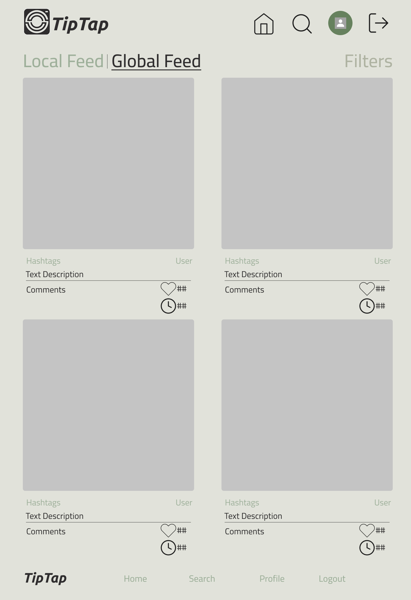
  
  

  <h3 style="font-size: 28px; color: #2F2D2E; margin-top: 5px; padding-bottom: 0px;">Post Page</h3>
  

    This is the page what will show up if a user clicks onto a post. Here the user can:
    <ul>
      <li>Leave Comments on The Other User's Post</li>
      <li>Like The Other User's Post</li>
      <li>Report The Other User's Post</li>      
    </ul>
  

  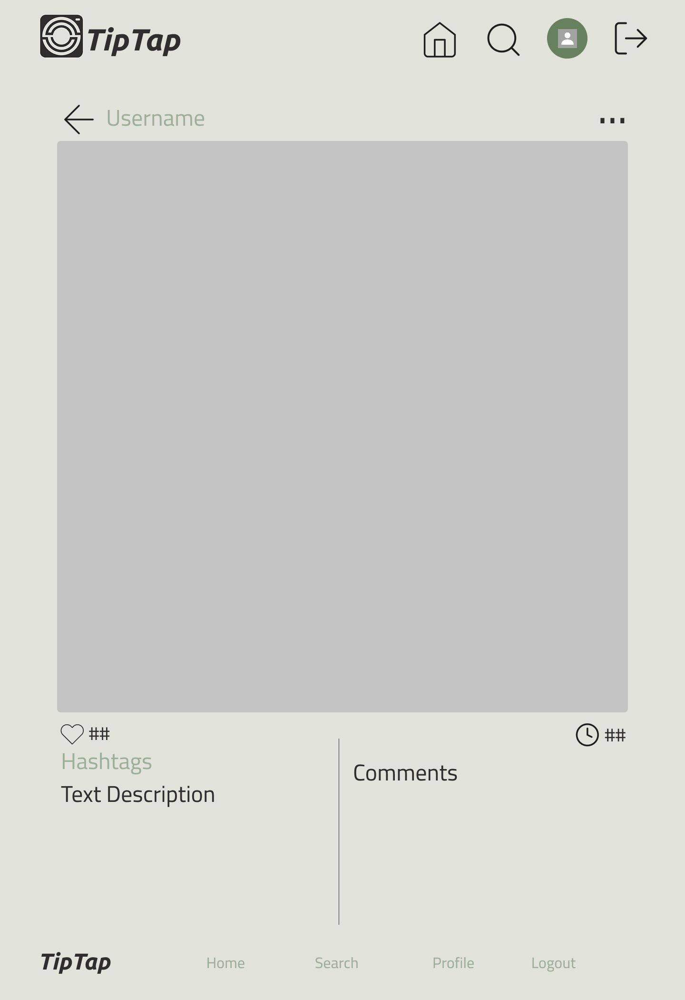
  
  

  <h3 style="font-size: 28px; color: #2F2D2E; margin-top: 5px; padding-bottom: 0px;">Profile Page</h3>
  

    This is the page that will show up when a user's profile is viewed:
    <ul>
      <li>If the user is the person viewing the profile the green buttons are visible to the user</li>
      <li>If the user viewing the profile is the user or a friend of the user then they can view the list of friends that belongs to the profile.</li>
      <li>The user viewing the profile will be able to use the `status` section to see what their relationship with the user whose profile is being viewed. Possible options:
        <ul>
          <li>Friends</li>
          <li>Friend Request Pending</li>
          <li>Not Friends</li>
        </ul>
        You can click this status in order to remove them as a friend</li>
      <li>The viewing user can view all of the user whose profile is being viewed posts.</li>
    </ul>
  

  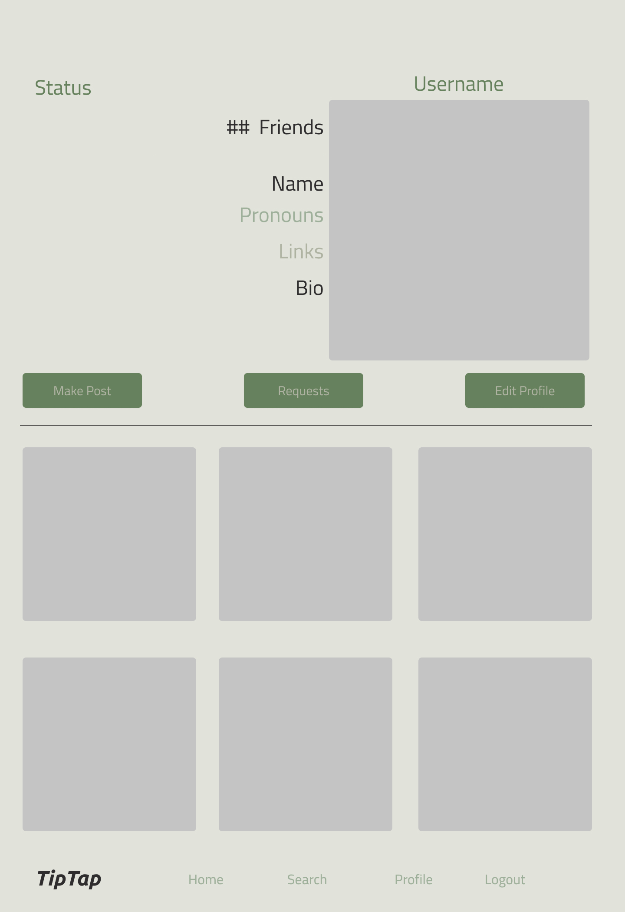
  
  

  <h3 style="font-size: 28px; color: #2F2D2E; margin-top: 5px; padding-bottom: 0px;">New Post Page</h3>
  

    The is the page that will come up when the user clicks the `New Post` button. Here the user can:
    <ul>
      <li>Add an Image</li>
      <li>Add a Text description - optional</li>
      <li>Add a Hashtags - optional</li>
    </ul>
  

  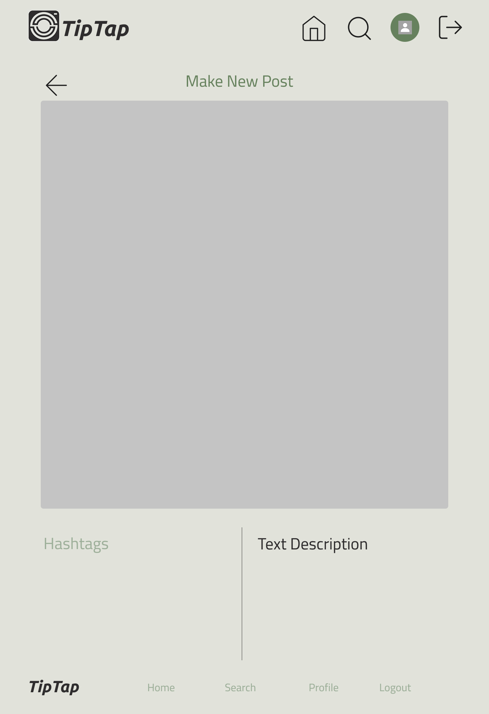
  
  

  <h3 style="font-size: 28px; color: #2F2D2E; margin-top: 5px; padding-bottom: 0px;">Follower List</h3>
  

    This is where a user can view a users follow list, this user can be a friend of the user whose list is being viewed or it can be the user who the list belongs too. On this page a user can:
    <ul>
      <li>View All of The Friends</li>
      <li>If it is the owner of the list viewing the list they can then remove a user on the list as a friend</li>
      <li>Click on the user in the list to view their profile</il>
    </ul>
  

  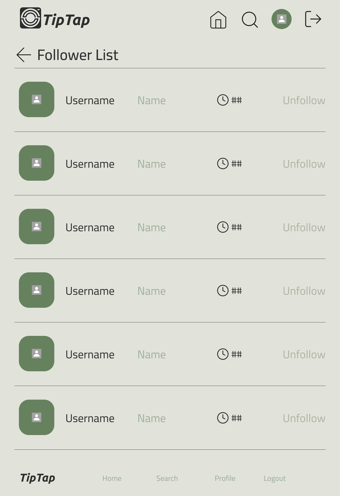
  
  

  <h3 style="font-size: 28px; color: #2F2D2E; margin-top: 5px; padding-bottom: 0px;">Requests Page</h3>  
  

    This is where a user can view the other users that have requested to be friends with them, this is accessible through the `Requests` page from the Profile page. Here a user can:
    <ul>
      <li>Approve a User as a Friend</li>
      <li>Reject a User as a Friend</li>
      <li>Click on the user in the list to view their profile</li>
    </ul>
  

  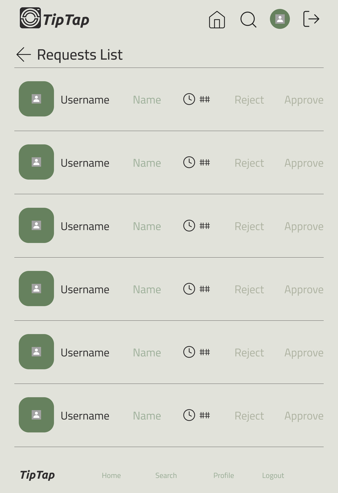

</html>